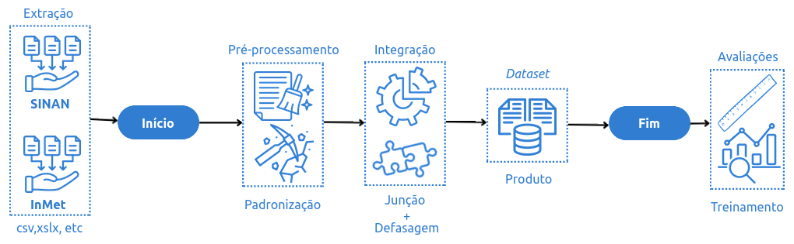

# ArbovirusFramework: Pipeline de Processamento e Integração de Dados Climáticos e Epidemiológicos




## 📄 Visão Geral

Este repositório contém o código principal (`main.py`) do **ArbovirusFramework**, um projeto dedicado à automação da coleta, padronização e integração de dados climáticos e epidemiológicos de arboviroses (como Dengue, Chikungunya e Zika) para análise e modelagem.

O framework visa facilitar a criação de *datasets* robustos para pesquisas e sistemas de monitoramento em saúde pública, superando a dificuldade de integração de dados de diversas fontes e formatos, um problema que frequentemente compromete os princípios da **Ciência Aberta**.

## ✨ Funcionalidades

* **Ingestão de Dados Brutos:** Processa arquivos CSV de dados climáticos (espera-se o formato INMET) e epidemiológicos (espera-se o formato SINAN).
* **Padronização de Colunas:** Renomeia colunas para garantir consistência e facilitar o uso dos dados.
* **Agregação e Transformação Climática:** Calcula médias, somas e outras *features* climáticas, incluindo defasagens temporais relevantes para estudos epidemiológicos (ex: média de temperatura dos últimos 7, 14, 21 dias).
* **Pré-processamento Epidemiológico:** Limpa e organiza dados de casos de doenças (filtragem, agregação diária), preparando-os para análise.
* **Combinação Inteligente:** Integra dados climáticos e epidemiológicos, alinhando-os por data e município, criando um *dataset* unificado e pronto para uso.
* **Tratamento de Erros Robusto:** Inclui tratamento de exceções para lidar com falhas no processamento de cidades individualmente, permitindo a continuidade do pipeline para outros municípios sem interrupção total.
* **Modularidade:** Construído em módulos (`ingestion`, `transformations`, `combination`, `exceptions`) para facilitar a manutenção, extensão e reutilização de componentes do framework.

## 🚀 Como Funciona (O Pipeline)

O script `main.py` atua como o orquestrador do pipeline de processamento de dados, seguindo os passos:

1. **Configuração de Cidades:** Através da lista `CITIES_TO_PROCESS`, define quais municípios e quais arquivos de dados brutos correspondentes serão processados.
2. **Processamento Climático:** Para cada cidade, lê os arquivos de dados meteorológicos brutos, padroniza as colunas e aplica transformações necessárias, como agregações e cálculo de defasagens temporais.
3. **Processamento Epidemiológico:** Carrega os dados de casos de arboviroses para cada cidade, realizando o pré-processamento e a agregação diária de casos.
4. **Combinação de Dados:** Mescla os dois conjuntos de dados (climáticos processados e epidemiológicos) em um único *dataset* unificado por município e data, criando a base para análises ou modelos.

## 📁 Estrutura do Projeto

```bash

.
├── ArbovirusFramework/
│   ├── **init**.py          \# Inicialização do pacote Python
│   ├── ingestion.py         \# Módulo para ingestão, leitura e pré-processamento de dados brutos
│   ├── transformations.py   \# Módulo para transformações de dados e criação de features
│   ├── combination.py       \# Módulo para combinar os DataFrames processados
│   └── exceptions.py        \# Módulo que define exceções personalizadas do framework
├── data/
│   ├── raw/                 \# Pasta dedicada aos dados brutos de entrada
│   │   ├── belo\_horizonte/  \# Exemplo: subpasta para dados de Belo Horizonte
│   │   │   ├── dengue\_20\_24\_MG\_reduzido.csv    \# Exemplo de arquivo epidemiológico bruto
│   │   │   └── dados\_A521\_D\_2020-01-01\_2024-12-31.csv \# Exemplo de arquivo climático bruto (INMET)
│   │   └── [outras\_cidades]/\# Adicione subpastas para outras cidades conforme configurado em main.py
│   └── processed/           \# Pasta para os outputs processados pelo framework
│       └── combined\_datasets/ \# Subpasta para os datasets combinados finais
│           └── belo\_horizonte\_combined\_data.csv \# Exemplo de arquivo de saída combinado
├── main.py                  \# Script principal que orquestra todo o pipeline de processamento
├── README.md                \# Este arquivo de documentação
└── requirements.txt         \# Lista das dependências Python do projeto

````

## 🛠️ Primeiros Passos

Siga as instruções abaixo para configurar e executar o projeto em sua máquina local.

### Pré-requisitos

* Python 3.8 ou superior
* `pip` (gerenciador de pacotes Python)

### Preparação dos Dados

1. Crie a estrutura de pastas `data/raw/` no diretório raiz do projeto, se ainda não existir.
2. Dentro de `data/raw/`, crie uma subpasta para cada município que você deseja processar (ex: `belo_horizonte`).
3. Coloque seus arquivos CSV de dados climáticos e epidemiológicos brutos dentro das pastas de suas respectivas cidades. Os nomes dos arquivos devem corresponder aos especificados na configuração `CITIES_TO_PROCESS` em `main.py`.

* **Exemplo:** Para o município "Belo Horizonte" configurado no `main.py`, os arquivos `dengue_20_24_MG_reduzido.csv` (epidemiológico) e `dados_A521_D_2020-01-01_2024-12-31.csv` (climático) devem ser colocados em `data/raw/belo_horizonte/`.

### Configuração

* Abra o arquivo `main.py` em seu editor de código.
* Ajuste a lista `CITIES_TO_PROCESS` para incluir os municípios que você deseja processar. Certifique-se de que os valores para `id_municipio`, `municipio_name`, `folder_name`, `raw_epi_filename` e `raw_climate_filenames` correspondam exatamente aos seus dados e à estrutura de pastas que você preparou.

### Executando o Script

Para iniciar o pipeline de processamento e integração de dados, execute o script `main.py` a partir do diretório raiz do projeto no seu terminal:

```bash
python main.py
````

## 📊 Saída (Output)

Após a execução bem-sucedida, os *datasets* combinados para cada município processado serão salvos automaticamente no diretório `data/processed/combined_datasets/`. Cada arquivo CSV de saída será nomeado com base no nome do município (ex: `belo_horizonte_combined_data.csv`). Estes arquivos estarão prontos para serem utilizados em análises exploratórias, estatísticas e para o treinamento de modelos de Machine Learning.

## ⚠️ Tratamento de Erros

O script incorpora um robusto tratamento de exceções (`try...except`) em cada etapa crucial do pipeline. Isso garante que:

* Se ocorrer um erro durante o processamento de dados para um município específico, o erro será capturado e uma mensagem de aviso será exibida no console.
* A execução do script **não será interrompida**, e o pipeline tentará continuar o processamento para os municípios restantes, maximizando a eficiência da execução em lote.
* Erros específicos do `ArbovirusFramework` (`exceptions.ArbovirusFrameworkError`) são tratados separadamente para maior clareza.

## 🤝 Contribuições

Contribuições para o **ArbovirusFramework** são muito bem-vindas\! Se você tiver sugestões de melhorias, encontrar *bugs* ou quiser adicionar novas funcionalidades, por favor, sinta-se à vontade para:

* Abrir uma *Issue* no repositório.
* Enviar um *Pull Request* com suas modificações.

## 📄 Licença

Este projeto está licenciado sob a Licença MIT. Para mais detalhes, consulte o arquivo `LICENSE` no repositório.

## ✉️ Contato

Para dúvidas, sugestões ou informações adicionais, você pode contatar os autores:

* **Franklin Sales de Oliveira:** [fsoliveira@inf.ufpel.edu.br](mailto:fsoliveira@inf.ufpel.edu.br)
* **Dulcinéia Esteves Santos:** [dulcineiaestevessantos@gmail.com](mailto:dulcineiaestevessantos@gmail.com)
* **Bianca Conrad Bohm:** [biankabohm@hotmail.com](mailto:biankabohm@hotmail.com)
* **Brenda Salenave Santana:** [bssalenave@inf.ufpel.edu.br](mailto:bssalenave@inf.ufpel.edu.br)
